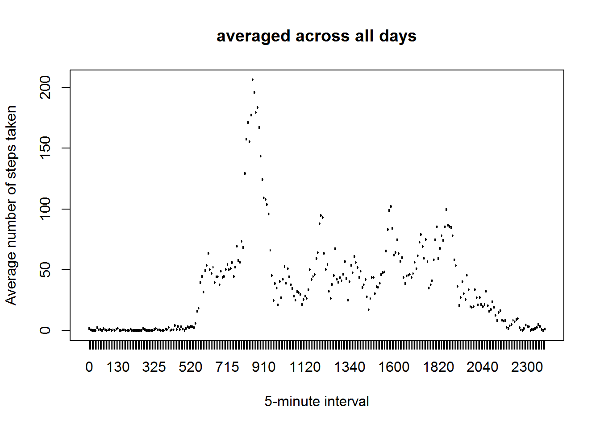

Reproducible Research: Peer Assessment 1
========================================================


#### Loading and preprocessing the data


```r
unzip("activity.zip")
```

```
## Warning in unzip("activity.zip"): error 1 in extracting from zip file
```

```r
activity <- read.csv("activity.csv")

# Convert strings in "date"" column to date objects.
activity$date <- as.Date(activity$date)

# Convert interval to a factor
activity$interval <- as.factor(activity$interval)
```

#### What is mean total number of steps taken per day?


```r
total.steps <- tapply(activity$steps, activity$date, FUN = sum, na.rm = TRUE)

# Make a histogram of the total number of steps taken each day
hist(total.steps, breaks = 5, col = "blue", main = "Distribution of the total Number of steps each day", xlab = "Total steps")
```

 

```r
# Calculate and report the mean and median total number of steps taken per day
mean(total.steps)
```

```
## [1] 9354.23
```

```r
median(total.steps)
```

```
## [1] 10395
```

#### What is the average daily activity pattern?


```r
library(ggplot2)

# Make a time series plot (i.e. type = "l") of the 5-minute interval (x-axis) and the average number of steps taken, averaged across all days (y-axis)
interval.stepsmeans <- aggregate(steps ~ interval, data=activity, mean)
plot(interval.stepsmeans$interval, interval.stepsmeans$steps, type="l", col="blue", xlab="5-minute interval", ylab="Average number of steps taken", main="averaged across all days")
```

 

```r
# Which 5-minute interval, on average across all the days in the dataset, contains the maximum number of steps?
interval.stepsmeans[which.max(interval.stepsmeans$steps), ]
```

```
##     interval    steps
## 104      835 206.1698
```

#### Imputing missing values


```r
# Note that there are a number of days/intervals where there are missing values (coded as NA). The presence of missing days may introduce bias into some calculations or summaries of the data.

# Calculate and report the total number of missing values in the dataset (i.e. the total number of rows with NAs)
sum(is.na(activity$steps))
```

```
## [1] 2304
```

```r
# Devise a strategy for filling in all of the missing values in the dataset. The strategy does not need to be sophisticated. For example, you could use the mean/median for that day, or the mean for that 5-minute interval, etc.
fv <- function(s, i) {
    filled <- NA
   if (!is.na(s)) 
       filled <- c(s) else filled <- (interval.stepsmeans[interval.stepsmeans$interval == i, "steps"])
     return(filled)
}
newac <- activity
newac$steps <- mapply(fv, newac$steps, newac$interval)

# Make a histogram of the total number of steps taken each day and Calculate and report the mean and median total number of steps taken per day. Do these values differ from the estimates from the first part of the assignment? What is the impact of imputing missing data on the estimates of the total daily number of steps?
total.steps <- tapply(newac$steps, newac$date, FUN = sum)
qplot(total.steps, binwidth = 1000, xlab = "total number of steps taken each day")
```

 

```r
mean(total.steps)
```

```
## [1] 10766.19
```

```r
median(total.steps)
```

```
## [1] 10766.19
```

#### Are there differences in activity patterns between weekdays and weekends?

```r
# For this part the weekdays() function may be of some help here. Use the dataset with the filled-in missing values for this part.
library(lattice)
library(plyr)
weekdays <- weekdays(as.Date(newac$date))
data_with_weekdays <- transform(newac, day=weekdays)
data_with_weekdays$wk <- ifelse(data_with_weekdays$day %in% c("Saturday", "Sunday"),"weekend", "weekday")
average_by_interval_wk <- ddply(data_with_weekdays, .(interval, wk), summarise, steps=mean(steps))

xyplot(steps ~ interval | wk, data = average_by_interval_wk, layout = c(1, 2), type="l")
```

 
